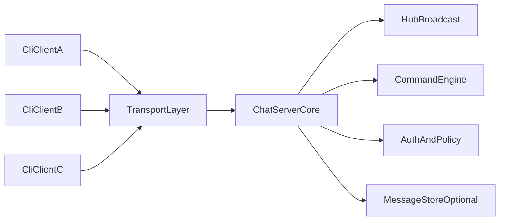
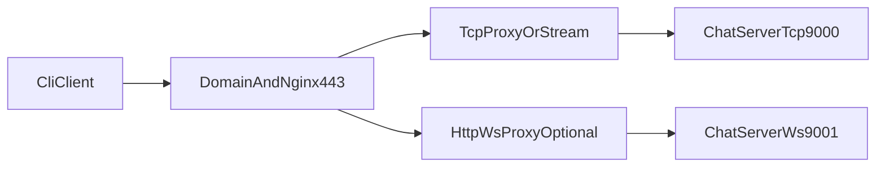
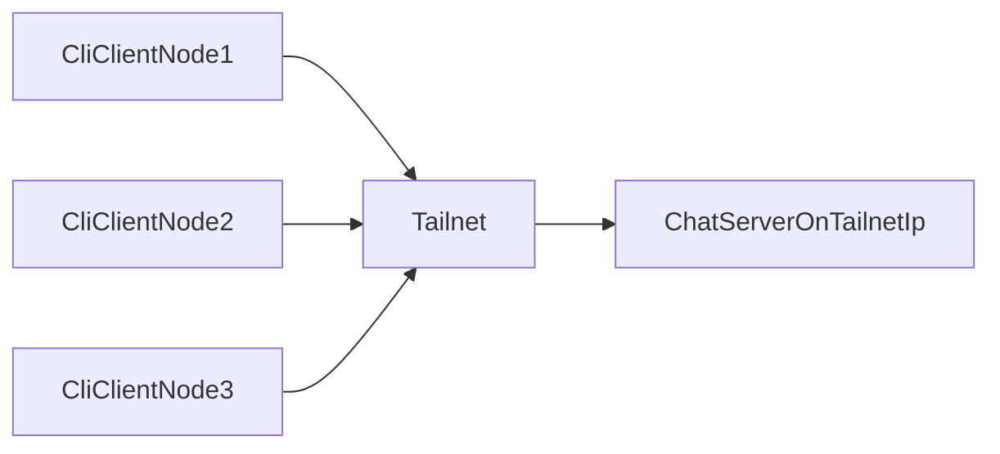

# Go CLI 实时聊天室可切换网络架构

## 目标
- 满足多人实时同步、回车发送、消息/指令即时推送。
- 保持客户端命令简洁：`./chat -server <addr>`。
- 网络形态可切换：公网服务器部署、Tailscale 局域网直连。
- 配置可热切换（至少重启生效），避免改代码。

## 总体架构

- `CliClient`：输入与接收分离（双协程），回车即发送。
- `TransportLayer`：统一抽象 TCP（必选）与 WS（可选）。
- `ChatServerCore`：会话管理、广播、命令执行。
- `ConfigLayer`：决定监听地址、认证策略、发现方式。

## 配置优先的设计（核心）

定义统一配置文件（例如 `config.yaml`），至少包含：
- `mode`: `public` | `tailscale`
- `listen.tcp`: 例如 `0.0.0.0:9000` 或 `100.x.y.z:9000`
- `advertise_addr`: 客户端展示/下发的连接地址
- `auth.type`: `none` | `token`
- `tls.enabled`: `true/false`
- `nginx.enabled`: `true/false`
- `room.default`: 默认房间名
- `limits.max_clients`, `limits.write_queue`
- `heartbeat.interval_sec`, `heartbeat.timeout_sec`

客户端参数覆盖配置（优先级高）：
- `./chat -server <addr> -port 
 -nick <name> -token <t> -mode <public|tailscale>`

建议优先级：
1. CLI 参数
2. 环境变量（`CHAT_*`）
3. 配置文件
4. 内置默认值

## 两种部署模式

### 1) 公网服务器模式（Public）

- 生产推荐：`443` 统一入口，Nginx 分发。
- 也可双端口直连：TCP `9000`，WS `9001`。
- 认证建议启用 token；可加 fail2ban/限流。

### 2) Tailscale 模式（LAN）

- 服务仅监听 Tailscale IP（`100.x.x.x`）或 `0.0.0.0` + ACL 限制。
- 客户端用 MagicDNS 或 Tailnet IP：
  - `./chat -server chat-host.tailnet-name.ts.net`
- 通常可关闭公网暴露与 Nginx，运维更轻。
- 认证可降级（只在可信 tailnet），但建议仍保留轻量 token。

## 传输与协议方案

- 首选 `TCP + JSONL`（每行一条 JSON），易调试、易扩展。
- 事件类型：
  - `auth`：鉴权/昵称注册
  - `msg`：聊天消息
  - `cmd`：命令请求（`/users` `/join` `/nick`）
  - `event`：服务端推送（消息、系统通知、命令结果）
- 所有结果走同一推送通道，保证“无需刷新即时更新”。

## 服务端并发模型

- `Hub` 单协程管理全局状态：
  - `register/unregister/broadcast`
  - `rooms` 成员关系
- 每连接两协程：
  - `readPump` 读入站
  - `writePump` 写出站（发送队列）
- 慢客户端保护：发送队列超限自动断开，避免广播阻塞。
- 心跳机制：定期 ping + 超时回收僵尸连接。

## 客户端交互模型

- 主线程：读取 stdin，回车发送。
- 接收线程：持续读 socket，实时打印。
- 渲染策略：
  - 输入行与异步消息冲突时，重绘提示符（保持“极简但可用”）。
- 断线重连：指数退避（1s/2s/4s...上限 30s）。

## 安全与运维建议

- Public 模式：
  - 必开 token 鉴权 + 连接限速 + 基础日志审计。
  - 建议 TLS 终止在 Nginx。
- Tailscale 模式：
  - 使用 tailnet ACL 控制谁能连服务端节点。
  - 仍保留应用层 token 以防误入网段。
- 观测：
  - 指标：在线人数、广播速率、消息延迟、断线原因。
  - 日志分级：`info/warn/error`。

## 兼容你需求的启动方式

- 公网：`./chat -server domain.com -port 443`
- Tailscale：`./chat -server chat-host.tailnet.ts.net -port 9000`
- 同一客户端二进制无需改动，仅改参数/配置。

## 实施分阶段

1. **MVP**：TCP、广播大厅、`/users`、回车发送、实时推送、基础心跳。
2. **配置层**：完成 `public/tailscale` 模式切换与参数优先级。
3. **增强**：房间、私聊、消息持久化、WebSocket 网页端（可选）。
4. **生产化**：Nginx、监控、限流、自动化部署。